We gaan met 2D game "framework" Löve2D een shooter bouwen.

<!--more-->

We gaan een eenvoudige shooter maken. Deze instructie is een vertaling en bewerking van een [tutorial](http://osmstudios.com/tutorials/your-first-love2d-game-in-200-lines-part-1-of-3) gemaakt door >_OSMSTUDIOS.

## Wat leer je?
Tijdens de Dojo's over Scratch hebben jullie kennis gemaakt met variabelen en functies (blokken). Daar gaan we mee verder.

In Scratch kun je met drag-and-drop variabelen en functies combineren tot een programma, maar bij de meeste 
programmeertalen wordt het programma in tekst geschreven. Dat is ook het geval bij Löve. We gaan dus typen.

Om het geen type sessie te laten zijn, zijn een aantal functies, net als bij Scratch, al voor jullie gemaakt. 
Je hoeft ze dus niet helemaal zelf meer te maken. Je hoeft ze alleen maar te gebruiken.

## Benodigdheden
Om deze instructie te kunnen volgen, moet je Löve en een goede editor geïnstalleerd hebben. 
Verder moet je wat code downloaden om verder op te bouwen, maar dit wordt in stap 0 uitgelegd.

### Installatie Löve
Hopelijk heb je de installatie al voorbereid na het ontvangen van de uitnodiging voor deze Dojo. Als dat zo is, kun je 
dit hoofdstukje overslaan en doorgaan naar Stap 1.

#### Windows
Löve is op Windows gemakkelijk te installeren via één van de installers. Als alternatief kun je kiezen voor één van de 
zipbestanden en deze op een gewenste locatie unzippen. Maak het jezelf gemakkelijk door Löve op een eenvoudig te 
onthouden plek te installeren, bijvoorbeeld in de map

    c:\love\

Zie de [Löve download pagina](https://love2d.org/#download) voor de installatie bestanden.
Als je twijfelt tussen de 32- of 64-bits versie, kun je voor de zekerheid kiezen voor 32-bits versie of gewoon even 
[checken](https://support.microsoft.com/nl-nl/help/13443/windows-which-operating-system) welke versie je hebt.

#### Mac
[Download](https://love2d.org/%23download) het zip bestand voor Mac en unzip het op de gewenste locatie.

#### Linux
Voor Ubuntu kun je kiezen voor het toevoegen van de [Löve PPA](https://launchpad.net/~bartbes/%2Barchive/ubuntu/love-stable)
 of voor de installatie van één van de .deb bestanden.

#### Tekst editor
Als je gaat programmeren is het handig om een editor te installeren met meer mogelijkheden dan 'kladblok'.
[Sublime Text](https://www.sublimetext.com/3) snapt Lua en dus Löve. Als alternatief kun je kiezen voor 
[Notepad++](https://notepad-plus-plus.org/download/).

## Stappen

TIP: de onderstaande stukken code hoef je niet over te typen. Je kunt ze natuurlijk gewoon copy-pasten in je editor.

### Stap 0: installatie voorbereidde code
Download the code van GitHub: [Löve 2D shooter code](https://github.com/coderdojonijmegen/love2d-shooter/archive/master.zip)
De zip-file bevat een `src/` folder. Kopieer de inhoud daarvan naar `c:\games\shooter`
Om de voorbereidde code uit te voeren, druk je op de Windows knop en typ je 'cmd'. Je krijgt dan een zwart venster. 
Typ dan cd `c:\games\shooter` om naar de folder te gaan waar je de code hebt neergezet. Typ tenslotte `c:\love\love.exe .\`
 om het programma te starten. Als alles goed gaat, krijg je een zwart venster.

### Stap 1: teken het vliegtuig van de speler
In deze stap doen we het volgende:

We laden het plaatje van het vliegtuig van de speler
Tekenen het plaatje op het scherm
Open `main.lua` in je tekst editor en type het volgende:


	-- variabele om het plaatje in op te slaan
	spelersVliegtuig = nil
	
	function love.load(arg)
	  -- laadt het plaatje in de variabele
	  spelersVliegtuig = love.graphics.newImage('plaatjes/spelersVliegtuig.png')
	end


En vervolgens om op het scherm te tekenen:


	function love.draw(dt)
	  -- teken het plaatje op het scherm
	  love.graphics.draw(spelersVliegtuig, 100, 100)
	end

	
Start je programmaatje en zie het resultaat:

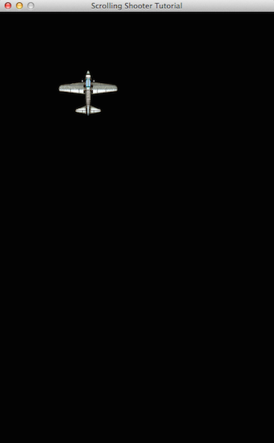


### x en y as

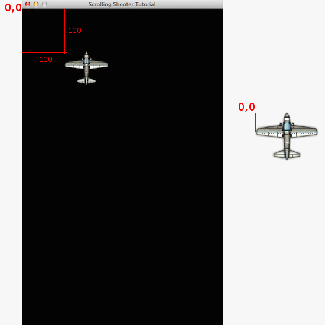

In de code hebben we bij het aanroepen van functie `love.graphics.draw` twee keer het getal 100 gebruikt. Deze worden 
gebruikt om de positie van het plaatje in het scherm te bepalen. Daarbij is positie 0,0 links bovenin. Bij 100,100 is 
het plaatje dus 100 stappen naar beneden en 100 naar rechts verschoven ten opzichte van 0,0.
Voor de horizontale positie wordt vaak variabele naam x gebruikt en voor de verticale positie y.

In Scratch komen x en y waarden voor de plaats van een Sprite ook terug. Hieronder staat Scratch op x = 31 en y = -36

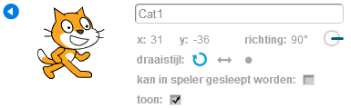



### Stap 2: eigenschappen van de speler
Het vliegtuig van de speler staat nu nog stil op positie 100,100, maar zal natuurlijk van links naar rechts gaan bewegen 
als we wat verder zijn. Je zou kunnen zeggen dat de speler een aantal eigenschappen heeft:

- het plaatje
- de positie

Om die informatie bij elkaar te houden, vervangen we variabele `spelersVliegtuig` door een nieuwe variabele waarin 
meerdere eigenschappen opgeslagen kunnen worden:


	-- variabele om eigenschappen van de speler in op te slaan
	speler = { x = 200, y = 560, plaatje = nil }
	
	function love.load(arg)
	  -- laadt het plaatje in eigenschap plaatje van de variabele speler
	  speler.plaatje = love.graphics.newImage('plaatjes/spelersVliegtuig.png')
	end

	
Het tekenen van het plaatje moet ook aangepast worden, zodat de nieuwe variabele met spelers eigenschappen gebruikt worden:


	function love.draw(dt)
	  -- teken het plaatje op het scherm
	  love.graphics.draw(speler.plaatje, speler.x, speler.y)
	end

	
Start opnieuw je programma en zie dat het vliegtuig nu onder in het venster staat. De wijzigingen die je hebt gemaakt 
zijn een voorbereiding om plaatje te kunnen laten bewegen.

### Stap 3: de speler bewegen
Je programma toont nu alleen een stilstaand plaatje. Dat is natuurlijk niet erg interessant. In deze stap ga je het plaatje laten bewegen.

#### Bewegen met pijltjes
Om het plaatje te horizontaal te laten bewegen, moet de `speler.x` eigenschap worden aangepast. De waarde van `speler.x`
 moet kleiner worden om naar links te bewegen en groter om naar rechts te bewegen. Je kunt dit ook eenvoudig uitproberen 
 door de waarde 200 in de code groter of kleiner te maken en je programma te starten.

Om het plaatje te laten bewegen terwijl het programma draait, moet het programma gaan reageren op toetsen van je 
toetsenbord. De pijl naar links zorgt voor een beweging naar links en de pijl naar rechts voor een beweging naar rechts:

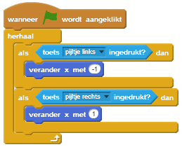


	function love.update(dt)
	  -- als pijltje naar links wordt ingedrukt
	  if love.keyboard.isDown('left') then
	
	    -- dan doe een stap naar links
	    speler.x = speler.x - 1
	
	  -- als pijltje naar rechts wordt ingedrukt
	  elseif love.keyboard.isDown('right') then
	
	    -- dan doe een stap naar rechts
	    speler.x = speler.x + 1
	  end
	end

	
Als je voor het eerst naar programmeercode kijkt ziet het bovenstaande er ingewikkeld uit, maar vergelijk het eens met 
het bewegen met pijltjes in Scratch. `love.update(dt)` wordt steeds opnieuw uitgevoerd en is daarom vergelijkbaar met 
de 'herhaal' in Scratch en 'if ... then' is gelijk aan 'als ... dan' in Scratch.

Als je de programmeercode hebt ingevoerd, kun je het programma starten om uit te proberen of het werkt.

Probeer ook eens een andere stapgrootte dan 1. Doet dat wat je ervan verwacht? Wat gebeurt er als je er een negatief getal van maakt?
Kun je de code aanpassen, zodat je ook naar boven en beneden kunt bewegen (gebruik toetsen 'up' voor naar boven en 'down' voor naar beneden)?
Wat gebeurt er als je bijvoorbeeld het pijltje naar rechts lang ingedrukt houdt?

#### Stoppen bij de rand
Om te voorkomen dat het plaatje onzichtbaar wordt, moeten we voorkomen dat het verder beweegt als het aan de randen 
van het venster komt. Aan de linker kant is dat makkelijk: beweeg niet verder als `speler.x` gelijk is aan 0. 
In code ziet dat er als volgt uit:


	-- als pijltje naar links ingedrukt
	if love.keyboard.isDown('left') then
	
	  -- en linker rand is nog niet bereikt
	  if speler.x > 0 then
	
	    -- dan doe een stap naar links
	    speler.x = speler.x - 1
	
	  end

    
Aan de rechter zijde is dat lastiger. Daar hangt de maximale 'x' af van de breedte van het venster. De maximale waarde 
voor x is gelijk aan de breedte van het venster, of `xRechterRand()`:


	-- als pijltje naar rechts ingedrukt
	elseif love.keyboard.isDown('right') then
	
	  -- en de rechter rand is nog niet bereikt
	  if speler.x < xRechterRand() then
	
	    -- dan doe een stap naar rechts
	    speler.x = speler.x + 1
	
	  end
	end

	
Pas de code die je eerder bij stap 3 (bewegen met pijltjes) hebt geschreven aan, zodat je stopt bij de rand. Controleer 
ook of het plaatje nu niet aan de rechterkant verdwijnt. Voor de duidelijkheid hebben we de Scratch code ook 
aangepast en bijgevoegd (zie plaatje rechts).

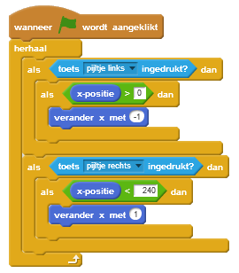

### Stap 4: de vijand
Het spel draait natuurlijk niet alleen om het heen en weer bewegen van een vliegtuigje. 
Er is ook een vijand. In deze stap gaan we vijanden maken.

We beginnen met het tekenen van één vijand. Daarvoor voegen we één regel toe (bijna bovenaan je code) en we voegen 
een regel code toe aan de `love.load()` en `love.draw()` functies:


	-- variabelen om eigenschappen van de speler en vijand in op te slaan
	speler = { x = 200, y = 560, plaatje = nil }
	vijand = { x = 200, y = 0, plaatje = nil }
	
	function love.load(arg)

	  -- laadt het plaatje in eigenschap plaatje van de variabele speler
	  speler.plaatje = love.graphics.newImage('plaatjes/spelersVliegtuig.png')
	  vijand.plaatje = love.graphics.newImage('plaatjes/vijandsVliegtuig.png')
	end
	
	function love.draw(dt)

	  -- teken het plaatje op het scherm
	  love.graphics.draw(speler.plaatje, speler.x, speler.y)
	  love.graphics.draw(vijand.plaatje, vijand.x, vijand.y)
	end

			
Probeer bovenstaande code uit.

Er is nu één vijand en deze staat recht tegenover de speler. Een stilstaande vijand is niet zo interessant, dus we laten 
'm naar de speler bewegen. Dat kan vrij eenvoudig door het volgende aan de code toe te voegen aan je `love.update(dt)` functie:


	function love.update(dt)

	  -- laat de vijand een stapje naar beneden doen 
	  vijand.y = vijand.y + 1

			
Bovenstaande code werkt hetzelfde als het verplaatsen van de speler. Nu bewegen we alleen wel verticaal (van boven naar 
beneden). Daardoor moeten we y in plaats van x veranderen. De positie van de vijand wordt steeds met 1 stapje naar 
beneden verzet. Zo beweegt de vijand naar de speler toe.

Om het plaatje van buiten het venster tevoorschijn te laten komen, moet de y positie aangepast worden naar -100. 
Pas de code bovenin je script aan door y = 0 te veranderen naar y = -100:


	vijand = { x = 200, y = -100, plaatje = nil }

			
Onder aan het scherm vliegt de vijand het venster uit en is dan verdwenen. Het is natuurlijk leuker als er aan de 
bovenkant een nieuwe vijand verschijnt. Daarvoor moet je, net als bij het bewegend maken van de vijand, 
onderstaande code toevoegen aan `love.update(dt)`:


	-- als de vijand de onderrand heeft bereikt
	if vijand.y > yOnderRand() then
	
	  -- verplaats het dan uit het zicht boven het venster
	  vijand.y = -100
	
	end

			
Om je te helpen met het begrijpen van de code: het verplaatsen van de vijand in Scratch zou er ongeveer zo uitzien:

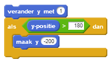

Om het nog interessanter te maken, zou het leuk zijn als de vijand niet steeds op dezelfde plaats van boven naar 
beneden beweegt. De waarde van `vijand.x` (horizontale positie) zou iedere keer anders moeten zijn. 
Gebruik daarvoor de functie `xWillekeurig()`:


	-- als de vijand de onderrand heeft bereikt
	if vijand.y > yOnderRand() then
	
	  -- verplaats het dan uit het zicht boven het venster
	  vijand.y = -100
	
	  -- en zet de horizontale positie naar een willekeurige waarde
	  vijand.x = xWillekeurig()
	
	end

			
Wat je in Scratch zo zou doen:

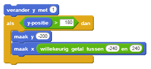

### Stap 5: meerdere vijanden
We hebben nu een enkele vijand. Die is natuurlijk makkelijk te ontwijken. Spannender wordt het, als we er meerdere hebben. 
Daarvoor moeten we het één en ander aanpassen, de code die je eerder hebt geschreven voor één vijand, gaan we vervangen 
met code voor meerdere vijanden. Je moet hier en daar dus code verwijderen!

Allereerst hebben we een lijst met vijanden nodig, die voegen we bovenaan de code toe, bij 'speler'. 
Variabelen staan vaak bovenaan in code:


	-- variabelen om eigenschappen van de speler in op te slaan
	speler = { x = 200, y = 560, plaatje = nil }
	
	-- lijst om vijanden in op te slaan
	vijanden = {}

			
Een andere variabele die we nodig hebben is het plaatje van de vijand. Eerder deden we dat in de functie `love.draw(dt)`
 met `speler.plaatje`. Die regel mag nu verwijderd worden en in plaats daarvan zetten we bij de variabelen 
 'speler' en 'vijanden' ook het plaatje voor de vijand:


	-- laad het plaatje van de vijand
	vijandPlaatje = love.graphics.newImage('plaatjes/vijandsVliegtuig.png')

			
De vijanden moeten ook getekend worden, zorg ervoor dat jouw `love.draw(dt)` functie eruit ziet zoals hieronder:


	function love.draw(dt)
	
	  -- teken het plaatje op het scherm
	  love.graphics.draw(speler.plaatje, speler.x, speler.y)
	
	  -- teken de vijanden in de lijst
	  tekenVijanden(vijanden)
	
	end

			
Er worden alleen vijanden getekend die bestaan, daarom moeten vijanden ook aangemaakt worden:


	function love.update(dt)
	
	  maakNieuweVijand(vijanden)

			
In de vorige stap hebben we de vijand laten bewegen. Deze code moeten we nu voor iedere vijand in de lijst uitvoeren:


	function love.update(dt)
	
	  maakNieuweVijand(vijanden) 
	
	  -- voor elke vijand in de lijst  
	  for index, vijand in ipairs(vijanden) do
	
	    -- laat de vijand een stapje naar beneden doen  
	    vijand.y = vijand.y + 2
	
	    -- als de vijand de onderrand heeft bereikt
	    if vijand.y > yOnderRand() then
	
	      -- verwijder de vijand
	      table.remove(vijanden, index)
	
	    end
	  end

			
Het maken en verwijderen van vijanden zoals we dat hierboven doen is in Scratch heel lastig. We geven daarom geen 
voorbeeld van het bovenstaande in Scratch. Waar het kan doen we dat wel.

Voer het programma uit. Als het goed is ziet het eruit als onderstaande plaatje:

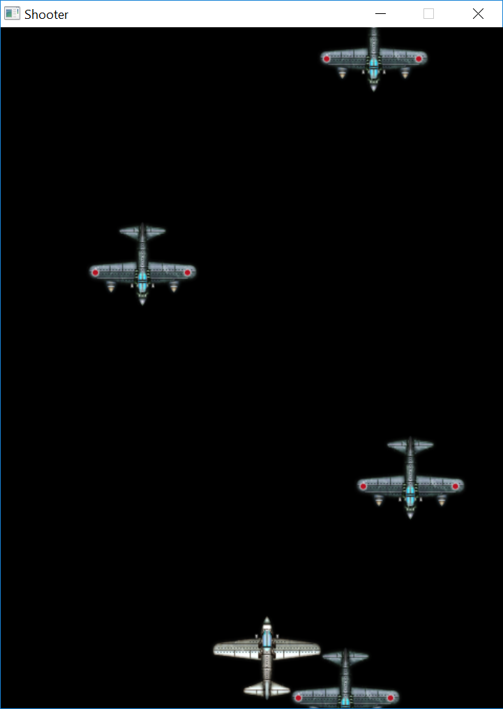

### Stap 6: de vijand ontwijken
Als de speler een vijand raakt, is het spel afgelopen. Om te zien of de speler een vijand geraakt heeft, hebben we 
functie `spelerHeeftVijandGeraakt()`.

Als het resultaat van de functie waar (true) is, dan moet het spel gestopt worden.

Voeg daarvoor de volgende code toe aan functie `love.update(dt)`:

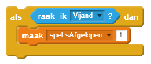


	-- als de speler een vijand geraakt heeft
	if spelerHeeftVijandGeraakt() then
	
	  -- is het spel afgelopen
	  spelIsAfgelopen = true
	
	end

			
In variabele `spelIsAfgelopen` wordt bijgehouden of het spel nog loopt of al is afgelopen. Als het is afgelopen, 
wordt de speler niet langer getekend. Pas daarvoor functie `love.draw(dt)` aan door het tekenen van de speler 
binnen een if statement te plaatsen:


	function love.draw(dt)
	
	  -- als het spel nog niet is afgelopen
	  if spelIsAfgelopen == false then
	
	    -- teken het plaatje op het scherm
	    love.graphics.draw(speler.plaatje, speler.x, speler.y)
	
	  end

			
In Scratch zou het er zo uitzien:

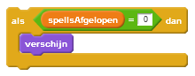

Vergeet niet om bovenaan het bestand de variabele toe te voegen:


	spelIsAfgelopen = false

			
Als je nu het spel speelt, wordt het spelersvliegtuig niet meer getekend als je een vijand hebt geraakt.

### Stap 7: schieten
De stap schieten lijkt op een combinatie van stappen 4 en 5..

Er moet een lijst worden toegevoegd voor de kogels:


	-- variabelen om eigenschappen van de speler in op te slaan
	speler = { x = spelerX, y = spelerY, plaatje = nil }
	
	-- lijst om vijanden in op te slaan
	vijanden = {}
	
	-- lijst om kogels in op te slaan
	kogels = {}

			
Het plaatje van de kogel moet worden geladen:


	-- laad het plaatje van de vijand
	vijandPlaatje = love.graphics.newImage('plaatjes/vijandsVliegtuig.png')
	
	-- laad het plaatje van de kogel
	kogelPlaatje = love.graphics.newImage('plaatjes/kogel.png')

			
En het plaatje moet worden getekend, dat doe je in de `love.draw(dt)` functie:


	-- teken de kogels in de lijst
	tekenKogels(kogels)

			
In tegenstelling tot de vijanden, worden nieuwe kogels alleen aangemaakt als de speler de spatiebalk indrukt. 
In de `love.update(dt)` functie voeg je het volgende toe:


    if spelIsAfgelopen == false then

	-- als de spatiebalk wordt ingedrukt
	if love.keyboard.isDown('space') then
	
	  -- schiet dan
	  maakNieuweKogel(kogels, speler)

	end

        maakNieuweVijand(vijanden)  

			
Als je de code tot nu toe uitprobeert, krijg je wel een kogels te zien, maar die bewegen niet, het ziet eruit als het plaatje hieronder.

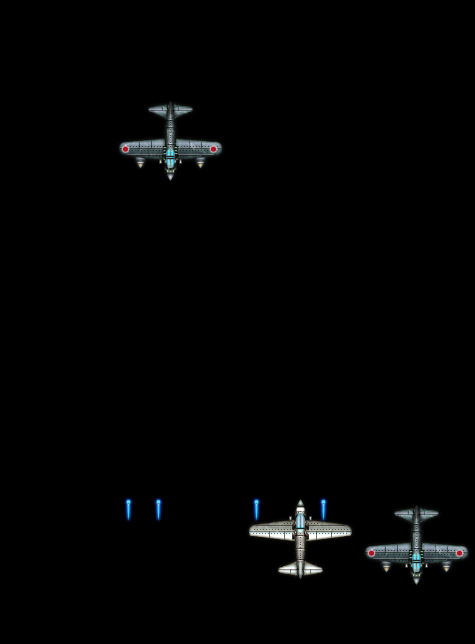

Aan de `love.update(dt)` functie moet nog wat extra code worden toegevoegd om de kogels te laten bewegen. 
Elke kogel in de lijst laten we telkens vier stappen omhoog gaan en als een kogel uit beeld verdwijnt, 
halen we de kogel ook uit de lijst:


    if spelIsAfgelopen == false then
        -- als de spatiebalk wordt ingedrukt
        if love.keyboard.isDown('space') then
            -- schiet dan
            maakNieuweKogel(kogels, speler)
        end

        -- voor elke kogel in de lijst
        for index, kogel in ipairs(kogels) do

            -- beweeg de kogel naar boven
            kogel.y = kogel.y - (2 * stapGrootte)

            -- als de kogel de bovenrand heeft bereikt
            if kogel.y < -20 then
                -- verwijder het uit de lijst
                table.remove(kogels, index)
            end
        end

        maakNieuweVijand(vijanden)  

			
Dat ziet er beter uit!

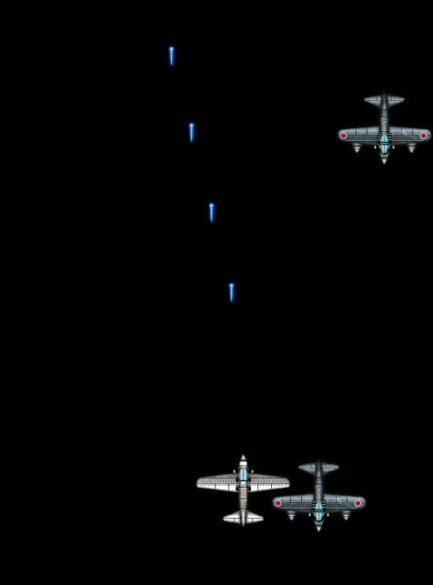

### Stap 8: raken en scoren
De vijanden vliegen, je kunt je vliegtuig richten en je kunt schieten. Maar je schoten raken nog niets en de 
vijanden vliegen door. Daar gaan we in deze stap wat aan doen.

Functie `kogelHeeftVijandGeraakt()` laat ons weten of een kogel een vijand geraakt heeft. 
Ook verwijderd deze functie de geraakte vijand en de kogel:


	-- als de kogel een vijand geraakt heeft
	if kogelHeeftVijandGeraakt() then
	
	  -- heb je een punt gescoord
	  score = score + 1
	
	end

			
Voeg bovenstaande code toe aan `love.update(dt)`. Om de score in op te slaan, moet je ook nog een variabele 
aanmaken boven aan het bestand:


	score = 0

			
In Scratch ziet het er zo uit:

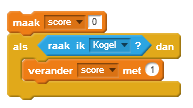

We willen natuurlijk de score kunnen zien, dus moeten we die in het scherm afdrukken. 
Voeg daarvoor in `love.draw(dt)` het volgende toe:


	-- zet de tekstkleur op wit
	love.graphics.setColor(255, 255, 255)
	
	-- en druk de score af
	love.graphics.print("SCORE: " .. tostring(score), 400, 10)

			
### Stap 9: opnieuw starten

Mocht je een vijand aanraken, dan is het spel afgelopen, maar dan wil je natuurlijk wel opnieuw kunnen beginnen. 
Daarvoor gaan we code toevoegen aan `love.update(dt)`:


  -- als de o van opnieuw wordt ingedrukt
  if love.keyboard.isDown('o') then

    -- wordt het spel opnieuw gestart
    kogels = {}
    vijanden = {}
    score = 0
    spelIsAfgelopen = false

  end

			
Als je op 'o' drukt begint je spel opnieuw. Het spel is nu klaar!

### Voorbereide functies
Bij het maken van het spelletje heb je gebruik gemaakt van een aantal voorbereide functies. Als je je nu afvraagt hoe 
die functies zijn gemaakt, dan kun je eens kijken in bestand [functies.lua](src/functies.lua).

### Voorbeeld code
Mocht je nu ook nog een voorbeeld van de volledige code willen bekijken, dan moet je eens kijken in 
[voorbeeld.lua](src/voorbeeld.lua).

## Conclusie
Het spelletje is af en je hebt geleerd hoe je vrij gemakkelijk een 2D shooter kunt maken met Löve.

## Vervolg
Als je meer wilt maken met Löve, dan zijn er meerdere instructies (in het Engels: tutorials) op het internet te vinden. 
Helaas zijn die wel vrijwel allemaal Engelstalig.

Een overzicht vind je op site van Löve zelf: https://love2d.org/wiki/Category:Tutorials.


